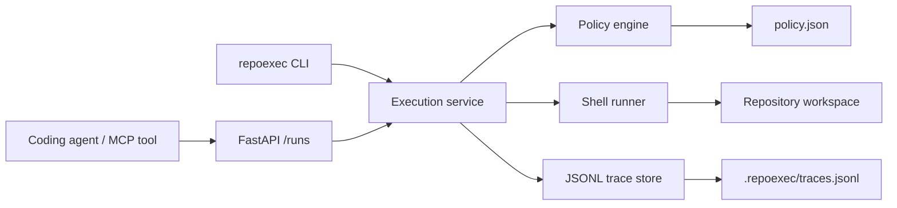

# RepoExec

[](https://github.com/whyujjwal/repoexec/actions/workflows/ci.yml)

**RepoExec is a GitHub-native execution layer for coding agents.** It gives agents a single, policy-checked place to run shell commands inside a repository workspace, with structured responses and durable JSONL traces for audit and replay.

Instead of letting an agent call `subprocess` directly, you route execution through RepoExec. Every request is evaluated against a local policy file, blocked when risky, and logged with enough context to debug or replay later.

## Why RepoExec exists

Coding agents need three things that raw shell access does not provide well:

| Need | Raw shell | RepoExec |
|------|-----------|----------|
| Guardrails | ad hoc prompts | explicit allow / deny / approval rules |
| Audit trail | scattered logs | append-only JSONL traces per run |
| Agent integration | one-off scripts | stable HTTP API + CLI |

RepoExec is intentionally narrow: it is **not** a full agent framework, queue, or GitHub App. It is the execution substrate those systems can call.

## Architecture



**Request flow**

1. Agent or CLI submits `workspace`, `command`, and optional metadata.
2. Policy engine evaluates the command (deny → approval → allow → default deny).
3. If allowed, the runner executes in the workspace with a timeout.
4. A trace record is appended to disk regardless of outcome.
5. Structured JSON is returned, including policy explanation fields.

## Quickstart

```bash
git clone https://github.com/whyujjwal/repoexec.git
cd repoexec
python3 -m pip install -e '.[dev]'
pytest -q
```

Run a command locally:

```bash
python3 -m repoexec.cli run \
  --workspace . \
  --command 'echo hello' \
  --policy examples/policy.json
```

Start the HTTP server:

```bash
python3 -m repoexec.cli serve --policy examples/policy.json --workspace-root .
```

The optional `--workspace-root` flag rejects run requests whose workspace resolves outside the given directory. Use it in production to block path-escape attempts.

Try the GitHub agent workflow demo:

```bash
chmod +x examples/github-agent-workflow.sh
./examples/github-agent-workflow.sh
```

## Policy file

Policies are JSON files with three rule lists:

```json
{
  "allow": ["echo *", "pytest*", "git status*"],
  "deny": ["rm *", "sudo*", "curl * | sh"],
  "require_approval": ["git push*", "npm publish*"]
}
```

**Precedence**

1. **deny** wins over everything
2. **require_approval** wins over allow
3. **allow** permits execution
4. Unmatched commands are denied

Matching supports simple substrings and glob patterns (`*`, `?`).

When a command is denied or requires approval, responses include:

- `policy_reason` — human-readable explanation
- `matched_rule` — the pattern that matched
- `rule_category` — `deny`, `require_approval`, `allow`, or `default`

## Approval tokens

Commands that match `require_approval` are blocked until a human issues a local HMAC token that binds to the exact `workspace` and `command`. No external services are involved.

**Configure a secret** (pick one):

- Environment variable: `REPOEXEC_APPROVAL_SECRET`
- Local file: `.repoexec/approval.secret` (created with `--create-secret`)

**Issue a token:**

```bash
repoexec approve \
  --workspace . \
  --command 'git push origin main' \
  --create-secret
```

**Run with the token:**

```bash
repoexec run \
  --workspace . \
  --command 'git push origin main' \
  --policy examples/policy.json \
  --approval-token '<token-from-approve>'
```

Via the API, include `approval_token` in the `POST /runs` body. The server loads the secret from `REPOEXEC_APPROVAL_SECRET` or `--approval-secret` at startup. Tokens expire after one hour by default (`--ttl-seconds` on `approve`).

Approved runs are recorded with `metadata.approved_via_token: true` in the trace log.

## Workspace root constraints

By default, RepoExec only checks that the workspace path exists and is a directory. For production deployments, pass `--workspace-root` to the server or CLI so every workspace must resolve inside a trusted directory:

```bash
repoexec serve --policy examples/policy.json --workspace-root /path/to/repo
repoexec run --workspace . --command 'pytest -q' --policy examples/policy.json --workspace-root .
```

Requests with workspaces outside the root return HTTP 400 (API) or exit code 1 (CLI) before policy evaluation or execution. Relative paths and `..` segments are resolved before the check.

## HTTP API

Base URL defaults to `http://127.0.0.1:8765`.

### `GET /healthz`

Health check.

```json
{"status": "ok"}
```

### `GET /explain`

Dry-run policy evaluation without executing or writing traces.

```bash
curl -s 'http://127.0.0.1:8765/explain?command=git%20push%20origin%20main'
```

### `POST /runs`

Submit an execution request.

```bash
curl -s -X POST http://127.0.0.1:8765/runs \
  -H 'Content-Type: application/json' \
  -d '{
    "workspace": ".",
    "command": "pytest -q",
    "timeout_seconds": 120,
    "approval_token": null,
    "metadata": {"agent": "cursor", "issue": "42"}
  }'
```

Example allowed response:

```json
{
  "run_id": "…",
  "decision": "allowed",
  "message": "Command executed.",
  "policy_reason": "Command matched allow rule 'pytest*'.",
  "matched_rule": "pytest*",
  "rule_category": "allow",
  "exit_code": 0,
  "duration_ms": 812,
  "stdout": "…",
  "stderr": ""
}
```

Denied and approval-required commands return structured responses **without executing**.

### `GET /runs`

List recent trace records (newest first).

```bash
curl -s 'http://127.0.0.1:8765/runs?limit=20&decision=denied'
```

Query parameters:

- `limit` — max records (default `50`, max `500`)
- `decision` — optional filter: `allowed`, `denied`, or `approval_required`

### `GET /runs/{run_id}`

Fetch a persisted trace record by ID.

### `POST /runs/{run_id}/replay`

Re-evaluate policy and re-run the stored command. The new trace includes `metadata.replayed_from`.

```bash
curl -s -X POST http://127.0.0.1:8765/runs/{run_id}/replay
```

## Trace log

Traces append to `.repoexec/traces.jsonl` by default (override with `--trace` on the CLI or when constructing the app). Each line is a JSON object with:

- `run_id`, `timestamp`, `workspace`, `command`
- `decision` (`allowed`, `denied`, `approval_required`)
- `policy_reason`, `matched_rule`, `rule_category`
- `exit_code`, `duration_ms`, `stdout`, `stderr` (when executed)
- `metadata` (agent name, issue id, replay source, etc.)

Traces are the source of truth. The in-memory index reloads from disk on startup.

## CLI

```bash
# Start API server
repoexec serve [--host 127.0.0.1] [--port 8765] [--policy examples/policy.json] [--trace .repoexec/traces.jsonl] [--workspace-root .] [--approval-secret .repoexec/approval.secret]

# Run a single command
repoexec run --workspace . --command 'echo hello' --policy examples/policy.json [--timeout 300] [--workspace-root .] [--approval-token <token>]

# Replay a stored run
repoexec replay --run-id <uuid> --policy examples/policy.json [--approval-token <token>]

# Issue an approval token for a require_approval command
repoexec approve --workspace . --command 'git push origin main' [--create-secret]

# Inspect traces
repoexec traces list [--limit 20] [--decision denied]
repoexec traces get --run-id <uuid>

# Dry-run policy evaluation (no execution, no trace write)
repoexec explain --command 'git push origin main' --policy examples/policy.json
```

Exit codes for `run` and `replay`:

- `0` — allowed and executed
- `1` — denied
- `2` — approval required

## Integrating a coding agent

A typical integration pattern:

1. Run RepoExec as a sidecar or local service in the repository workspace.
2. Point the agent's shell tool at `POST /runs` instead of direct execution.
3. Check `decision` in the response before treating output as success.
4. Use `policy_reason` to explain blocks to the user.
5. Persist `run_id` in agent logs for later audit or replay.

See `examples/github-agent-workflow.sh` for a minimal end-to-end demo.

## Project layout

```
repoexec/
  api.py        FastAPI routes
  approval.py   Local HMAC approval tokens
  cli.py        Typer CLI
  config.py     Defaults
  models.py     Request/response/trace models
  policy.py     Policy loading and evaluation
  runner.py     Workspace validation + subprocess execution
  service.py    Shared run/replay orchestration
  store.py      JSONL trace persistence
examples/
  policy.json
  github-agent-workflow.sh
tests/
```

## Development

```bash
python3 -m pip install -e '.[dev]'
pytest -q
pytest tests/test_api.py -q   # narrow scope while iterating
```

Design notes and MVP scope live in `docs/plans/2026-05-22-repoexec-mvp.md`. Planned work is tracked in `ROADMAP.md`.

## License

MIT — see [LICENSE](LICENSE).
